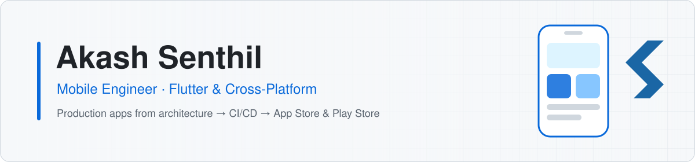

<!-- ============================================================
  PROFESSIONAL variant (shown on the profile by default).
  Creative variant lives in README-creative.md.
  Every section is wrapped in SECTION markers — edit freely.
============================================================= -->

<!-- SECTION:toggle -->

  
  

<!-- /SECTION:toggle -->

<!-- SECTION:header -->
<picture>
  <source media="(prefers-color-scheme: dark)" srcset="assets/banner-pro-dark.svg" />
  <source media="(prefers-color-scheme: light)" srcset="assets/banner-pro.svg" />
  
</picture>

  
  
  
  
  

<!-- /SECTION:header -->

<!-- SECTION:about -->
<table>
<tr>
<td width="60%" valign="top">

### About

I'm a **Mobile Engineer** in Bengaluru with **4 years** of shipping production Flutter apps for Android, iOS, Web and Desktop. I own the whole path, from architecture and state management to CI/CD, store releases and post-release maintenance.

At **[Samaaro](https://www.samaaro.com/)** I built a **white-label event app platform** that powers **7 production apps** from one codebase. It cut time-to-market for new client apps by about **70%**.

Outside work I'm on the **core team of [Namma Flutter](https://nammaflutter.com/team)**, where I speak at meetups, run workshops and contribute to open source.

</td>
<td width="40%" valign="top">

### Quick facts

- 💼 **Product Engineer** @ Samaaro
- 📱 **7+** production apps shipped
- 🧱 Clean & feature-first architecture
- 🚀 Fastlane · Shorebird OTA · GitHub Actions
- 🎤 Speaker, **5+** community sessions
- 🌱 Learning: Node.js backends & SwiftUI
- 🎯 2026: publish an open-source Flutter package

</td>
</tr>
</table>
<!-- /SECTION:about -->

<!-- SECTION:experience -->
### Experience

| Role | Company | Period | Highlights |
|---|---|---|---|
| **Product Engineer** | [Samaaro](https://www.samaaro.com/) · Bengaluru | Jul 2024 – Present | 5 client apps + 2 internal apps built from scratch · white-label architecture · CI/CD & store releases · boot-time and rendering optimisation |
| **Mobile Application Developer** | [WHY Global Services](https://whyglobalservices.com/) · Chennai | Oct 2022 – Jul 2024 | Interactive maps & routing · real-time WebSockets · third-party SDKs and native bridges |
<!-- /SECTION:experience -->

<!-- SECTION:projects -->
### Featured work

<table>
<tr>
<td width="50%" valign="top">

**Samaaro Events Platform** · `LIVE` 
A white-label Flutter platform for branded corporate event apps. It runs 7+ installs from one core repo, with runtime branding, chat, schedules and networking modules.  

</td>
<td width="50%" valign="top">

**Namma Wallet** · `Open source` 
A community-built Flutter wallet app. I contributed features, home-screen widgets, contributor modules, and the Fastlane CI/CD and release automation.  

</td>
</tr>
<tr>
<td width="50%" valign="top">

**PepsiCo Store Delivery App** · `LIVE` 
An enterprise delivery-routing app with an offline-first sync engine, store verification and native map integrations. Built to scale for dense delivery routes.  

</td>
<td width="50%" valign="top">

**Apex Invest Portal** · `LIVE` 
A fintech mobile app for investors and fund managers, with a biometric auth layer, real-time fund analytics charts and automated code signing.  

</td>
</tr>
</table>

Earlier work: <b>Trucklah</b> (goods transport with live tracking) · <b>Abhis LMS</b> (role-based learning platform with chat and video calls) · side projects <a href="https://github.com/AkashProfessionalCoder/dev_folio">dev_folio</a> and <a href="https://github.com/AkashProfessionalCoder/akash_senthil_portfolio">portfolio</a>.
<!-- /SECTION:projects -->

<!-- SECTION:stack -->
### Tech stack

<table>
<tr><td><b>Mobile</b></td><td></td></tr>
<tr><td><b>Web & backend</b></td><td></td></tr>
<tr><td><b>Data</b></td><td></td></tr>
<tr><td><b>DevOps & tools</b></td><td></td></tr>
</table>

**State management:** BLoC · Riverpod · GetX · Provider &nbsp;·&nbsp; **Delivery:** Fastlane · Shorebird OTA · App Store Connect · Play Console
<!-- /SECTION:stack -->

<!-- SECTION:stats -->
### GitHub activity

  <!-- Generated daily by .github/workflows/profile-metrics.yml into the `metrics` branch -->
  <picture>
    <source media="(prefers-color-scheme: dark)" srcset="https://raw.githubusercontent.com/AkashProfessionalCoder/akashProfessionalCoder/metrics/stats-dark.svg" />
    <source media="(prefers-color-scheme: light)" srcset="https://raw.githubusercontent.com/AkashProfessionalCoder/akashProfessionalCoder/metrics/stats.svg" />
    
  </picture>

<!-- /SECTION:stats -->

<!-- SECTION:writing -->
### Latest writing

<!-- BLOG-POST-LIST:START -->
- [Even experienced devs ignore security: 10 best practices for production Flutter apps](https://medium.com/nammaflutter/even-experinced-devs-ignore-security-10-best-practices-for-production-flutter-apps-android-e2a34b944ac3)
- [Automate Flutter iOS releases to the App Store using Fastlane](https://medium.com/nammaflutter/automate-flutter-ios-releases-to-the-app-store-using-fastlane-step-by-step-guide-6a935f6c6b10)
- [Dio vs HTTP in Flutter: why and how to use Dio efficiently](https://medium.com/nammaflutter/dio-vs-http-in-flutter-why-and-how-to-use-dio-efficiently-f13089b4ea83)
- [Deep linking in Flutter: complete guide](https://medium.com/nammaflutter/deeplinking-in-flutter-ad5a40759ef3)
<!-- BLOG-POST-LIST:END -->

➜ More on <a href="https://medium.com/@akashprocoder">Medium</a>
<!-- /SECTION:writing -->

---

<i>"Clean code, scalable architecture and seamless UX: that's what I aim for in every project."</i>

